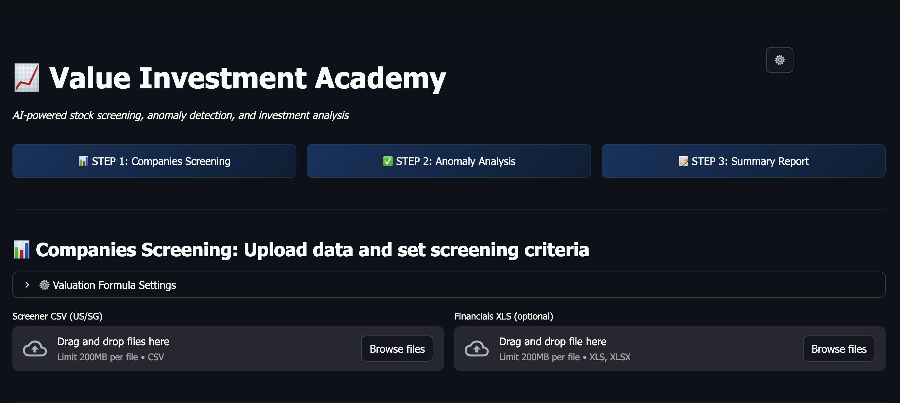

# Value Investment Academy

An AI-powered Python tool for value investors with stock screening, automated valuation, AI forensic anomaly detection, and professional report generation for US and Singapore markets.

**[Try the Live Demo](https://value-investment-academy.streamlit.app)**



## Features

### 1. Stock Screener (10 Criteria)
Filter stocks across US and Singapore markets with synced slider + text input controls:
- **Profitability**: Gross Margin %, Net Margin %, ROA %, ROE %, FCF Margin %
- **Growth**: 5-Year Revenue Growth, 5-Year EPS Growth
- **Efficiency**: ROIC - WACC, ROTE - WACC
- **Balance Sheet**: Debt-to-Equity Ratio
- **Exchange Filter**: Multi-select dropdown (NASDAQ, NYSE, SGX, etc.)
- **Multi-file Upload**: Combine US + SG CSV files with auto exchange detection

### 2. Automated Valuation (EPV-Based)
Configurable valuation thresholds using Earnings Power Value vs Market Cap:
- **Undervalued**: EPV/MC > threshold (default 1.3)
- **Fair Value**: Between thresholds
- **Overvalued**: EPV/MC < threshold (default 0.7)
- **Intrinsic Value Columns**: Highest (EPV), Lowest (EPV x margin of safety discount)

### 3. AI Anomaly Detection (OpenAI-Powered)
Replaces traditional M-Score/Z-Score checks with AI forensic analysis:
- Analyzes 10-year financial history from XLS, FMP API, or CSV data
- Detects one-off income/expenses, business model changes, margin distortions
- Rates each company: **CLEAN**, **MINOR**, or **MATERIAL**
- Provides specific year-by-year findings and valuation impact assessment

### 4. Professional Summary Report Dashboard
Bloomberg/FactSet-inspired Step 3 report with:
- **Executive Summary**: KPI stat cards, valuation/anomaly distribution charts, top picks
- **Portfolio Analytics**: Interactive Plotly radar chart, valuation scatter plot, metrics comparison bars
- **Company Deep Dive Cards**: 10-metric grid with color coding, progress bars, valuation row
- **Recommendation Table**: Conviction scoring (0-100), STRONG BUY/BUY/HOLD/WATCH ratings
- **DOCX Export**: AI-enhanced professional report generation via OpenAI

### 5. Company Detail Popup (FMP API)
Click "View Trends" on any stock card to see:
- Business description, CEO, location (via Financial Modeling Prep API)
- 10-year Revenue vs Net Income chart (Plotly)
- 10-year Free Cash Flow trend chart
- Graceful degradation when API key is not configured

### 6. AI Agent Team (OpenAI Agents SDK)
Multi-agent system with handoffs and specialized roles:

| Agent | Specialization | Tools |
|-------|---------------|-------|
| **Coordinator** | Routes tasks to specialists | All tools + handoffs |
| **Screening Agent** | Finds value stocks | Stock screening, comparison |
| **Anomaly Agent** | Forensic analysis | AI-powered detection |
| **Research Agent** | Investment thesis | Web search, news, real-time prices |

### 7. Real-Time Data Integration
- **Financial Modeling Prep**: Company profiles, financial statements, charts
- **Tavily**: Web search for latest company news
- **NewsAPI**: Financial headlines and market news
- **Twelve Data**: Real-time stock prices and historical data

## Quick Start

### Using uv (Recommended)

```bash
git clone https://github.com/alfredang/value-investment.git
cd value-investment

uv sync

cp .env.example .env
# Edit .env and add your API keys

uv run streamlit run app.py
```

### Using pip

```bash
git clone https://github.com/alfredang/value-investment.git
cd value-investment
pip install -r requirements.txt

cp .env.example .env
# Edit .env and add your API keys

streamlit run app.py
```

### Using Docker

```bash
docker pull tertiaryinfotech/value-investment:latest

docker run -p 8501:8501 \
  -e OPENAI_API_KEY=your-key \
  -e FMP_API_KEY=your-key \
  tertiaryinfotech/value-investment:latest
```

Then open http://localhost:8501 in your browser.

### Command Line Interface

```bash
python main.py screen --market US --roe 15 --gross-margin 30
python main.py analyze DDI
python main.py --help
```

## 3-Step Workflow

```
Step 1: Companies Screening     Step 2: AI Anomaly Analysis     Step 3: Summary Report
+------------------------+      +------------------------+      +------------------------+
| Upload CSV files       |      | AI analyzes 10-year    |      | Executive Summary      |
| Set 10 criteria        | ---> | financial history      | ---> | Portfolio Analytics     |
| Filter by exchange     |      | Rates CLEAN/MINOR/     |      | Company Deep Dives     |
| Select companies       |      | MATERIAL               |      | Recommendations        |
+------------------------+      +------------------------+      | Export DOCX Report     |
                                                                 +------------------------+
```

## Configuration

### Environment Variables

Create a `.env` file:

```bash
# Required
OPENAI_API_KEY=sk-your-api-key-here

# Optional - for enhanced features
FMP_API_KEY=your-key              # Company profiles, charts (financialmodelingprep.com)
TAVILY_API_KEY=tvly-your-key      # Web search (tavily.com)
NEWS_API_KEY=your-newsapi-key     # Market news (newsapi.org)
TWELVE_DATA_API_KEY=your-key      # Real-time prices (twelvedata.com)
```

## Project Structure

```
value-investment/
├── app.py                  # Streamlit web app (main)
├── summary_report.py       # Professional Step 3 dashboard (Plotly + HTML/CSS)
├── enhanced_report.py      # AI-enhanced DOCX report generator
├── fmp_api.py              # Financial Modeling Prep API client
├── main.py                 # CLI interface
├── ai_agents.py            # OpenAI Agents SDK implementation
├── screener.py             # Stock screening logic
├── valuation.py            # EPV-based valuation
├── anomaly_detector.py     # Financial anomaly detection
├── report_generator.py     # Markdown/Word report generation
├── data_loader.py          # CSV/XLS file parsing
├── requirements.txt        # pip dependencies
└── .env.example            # Environment variables template
```

## Dependencies

Core:
- pandas, xlrd - Data processing
- streamlit - Web UI
- plotly - Interactive charts (radar, scatter, bar)
- openai - AI-powered analysis and report generation
- python-docx - Word document generation
- requests - FMP API integration

Optional:
- tavily-python - Web search
- httpx - HTTP client for real-time data APIs

CLI:
- click, rich, tabulate - Command line interface

## Deploy to Streamlit Cloud

1. Fork this repository
2. Go to [share.streamlit.io](https://share.streamlit.io)
3. Click "New app" and select your fork
4. Add secrets in app settings:
   - `OPENAI_API_KEY`
   - `FMP_API_KEY` (optional, for company profiles)
   - `TAVILY_API_KEY` (optional, for web search)
   - `NEWS_API_KEY` (optional, for news)
   - `TWELVE_DATA_API_KEY` (optional, for real-time prices)
5. Deploy!

## License

MIT License
