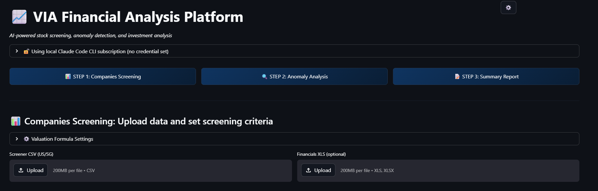

# Value Investment Academy

An AI-powered Python tool for value investors with stock screening, in-house DCF valuation, AI forensic anomaly detection, competitor analysis, and professional report generation for US and Singapore markets.

**[Try the Live Demo](https://value-investment-academy.streamlit.app)**



## Features

### 1. Stock Screener (10 Criteria)
Filter stocks across US and Singapore markets with synced slider + text input controls:
- **Profitability**: Gross Margin %, Net Margin %, ROA %, ROE %, FCF Margin %
- **Growth**: 5-Year Revenue Growth, 5-Year EPS Growth
- **Efficiency**: ROIC - WACC, ROTE - WACC
- **Balance Sheet**: Debt-to-Equity Ratio
- **Exchange Filter**: Multi-select dropdown (NASDAQ, NYSE, SGX, etc.)
- **Multi-file Upload**: Combine US + SG CSV files with auto exchange detection

### 2. In-House DCF Valuation Formula
Two-stage DCF model implementing the client's proprietary Excel formula:
- **Low IV (Conservative)**: historical EPS growth dampened ÷ 8 (capped at 3%)
- **High IV (Aggressive)**: historical EPS growth dampened ÷ 2 (capped at 12%)
- **Verdict**: Undervalued (price < Low IV) / Fair Value (within range) / Overvalued (price > High IV)
- **Defaults** (per client spec): 10% discount rate, 2% terminal growth, 30% margin of safety, 10y growth phase, 10y terminal phase
- **Inputs auto-derived** from CSV: Current Price, PE Ratio (or EPV × WACC fallback), 5-Year EPS Growth Rate

### 3. AI Anomaly Detection (Claude-Powered)
Replaces traditional M-Score/Z-Score checks with AI forensic analysis:
- Analyzes 10-year financial history from XLS, FMP API, or CSV data
- Detects one-off income/expenses, business model changes, margin distortions
- Rates each company: **CLEAN**, **MINOR**, or **MATERIAL**
- Provides specific year-by-year findings and valuation impact assessment

### 4. Professional Summary Report Dashboard
Bloomberg/FactSet-inspired Step 3 report with:
- **Executive Summary**: KPI stat cards, valuation/anomaly distribution charts, top picks
- **Portfolio Analytics**: Interactive Plotly radar chart, valuation scatter plot, metrics comparison bars
- **Competitor Comparison (live)**: Pick any final candidate → app finds peers in same Sector + Industry → side-by-side metrics table + 5 interactive Plotly bar charts
- **Company Deep Dive Cards**: 10-metric grid with color coding, progress bars, valuation row
- **Recommendation Table**: Conviction scoring (0-100), STRONG BUY/BUY/HOLD/WATCH ratings
- **DOCX Export**: AI-enhanced professional report generation via Claude

### 5. AI-Enhanced DOCX Report (Standardized Template)
Each company section follows a fixed 6-part research template:
- **A. Company Profile** — Name, Sector, Industry, AI-generated background
- **B. Valuation Range** — Low IV / Fair Value / High IV with verdict
- **C. Key Financial Metrics** — full metrics table with notes
- **D. 10-Year Financial Trends** — embedded line graphs (Revenue / Net Income / FCF)
- **E. Competitor Comparison** — 5 embedded bar charts vs peers
- **F. Analyst Assessment** — AI-generated business quality, risk, and investment thesis

### 6. Company Detail Popup (FMP API)
Click "View Trends" on any stock card to see:
- Business description, CEO, location (via Financial Modeling Prep API)
- 10-year Revenue vs Net Income chart (Plotly)
- 10-year Free Cash Flow trend chart
- Graceful degradation when API key is not configured

### 7. AI Agent Team (Claude Agent SDK)
Multi-agent system with subagent dispatch and specialized roles:

| Agent | Specialization | Tools |
|-------|---------------|-------|
| **Coordinator** | Routes tasks to specialists | All tools + Task dispatch |
| **Screening Agent** | Finds value stocks | Stock screening, comparison |
| **Anomaly Agent** | Forensic analysis | AI-powered detection |
| **Research Agent** | Investment thesis | Web search, news, real-time prices |

### 8. Real-Time Data Integration
- **Financial Modeling Prep**: Company profiles, financial statements, charts
- **Tavily**: Web search for latest company news
- **NewsAPI**: Financial headlines and market news
- **Twelve Data**: Real-time stock prices and historical data

### 9. Data Source Architecture — Firecrawl vs yfinance vs SEC EDGAR

The app pulls financial data from **three independent sources**, used in a fallback chain so the user always gets real data even when one source is unavailable. **No source talks to another — they are completely separate systems.**

| | Firecrawl | yfinance | SEC EDGAR |
|---|---|---|---|
| **What it is** | A paid web-scraping API service | A Python library | The official US filings database (data.sec.gov) |
| **What it does** | Fetches HTML/markdown from any URL | Talks directly to Yahoo Finance's internal data endpoints | HTTP GET against `data.sec.gov` |
| **Needs API key?** | **Yes** (`FIRECRAWL_API_KEY`) | **No** — just `pip install yfinance` | **No** — only a `User-Agent` with email per SEC fair-access policy |
| **Needs credits?** | **Yes** (500/month free, then $16+/mo) | **No** — completely free, no rate limit issues | **No** — public US-government data, free |
| **Coverage** | Any public URL the user configures | Any global ticker | US-listed companies only (forms 10-K, 20-F, 40-F) |
| **History depth** | 10+ years (when source pages have it) | 4-5 years | 10-20+ years |
| **Currently used for** | The 5 client-spec sites: Bloomberg, Reuters, Morningstar, Gurufocus, Stock Analysis | Step 2 Anomaly Analysis fallback | Step 3 Excel Report fallback (10-year VIA charts) |

**Data flow per step:**

```
Step 2 (Anomaly Analysis):
   Firecrawl scrape → yfinance fallback (if Firecrawl returns nothing)

Step 3 (Excel Report):
   Firecrawl scrape + Macrotrends → Claude extraction
                                  → SEC EDGAR fallback (if extraction returns < 6 of 8 metrics)
```

**Why three sources?** Each has a trade-off:

- **Firecrawl** is the only one that hits the four client-mandated sites (Bloomberg/Reuters/Morningstar/Gurufocus). When credits are available, it produces the richest data because those sites pre-format the financial tables.
- **yfinance** never runs out of credits and works for global tickers, but only returns 4-5 years of annual data on the free tier.
- **SEC EDGAR** is the **primary source** that Bloomberg/Reuters/Morningstar/Gurufocus all source their US-company data from. So when those sites are unreachable, going to EDGAR directly gives the *same underlying numbers* (10-K filings) with 10-20 years of history — for US filers only.

**Strict no-hallucination guarantee:** All three sources return real filings data. The app never falls back to LLM-generated/training-memory numbers — when no source has data, the chart or section is simply skipped (e.g. "data unavailable").

## Quick Start

### Prerequisites
- **Python 3.10+**
- **Node.js** (for Claude Code CLI)
- **Claude Code CLI** logged in via `claude /login`, plus a subscription token from `claude setup-token`

### Using pip

```bash
git clone https://github.com/alfredang/value-investment.git
cd value-investment
pip install -r requirements.txt

# One-time Claude Code CLI auth (if not already set up)
npm install -g @anthropic-ai/claude-code
claude /login
claude setup-token   # generates the subscription OAuth token used by the app

streamlit run app.py
```

Paste the token from `claude setup-token` into the auth panel at the top of the app, or set `CLAUDE_CODE_OAUTH_TOKEN` in your environment before launching.

### Using Docker

```bash
docker build -t value-investment .
docker run -p 8501:8501 \
  -e CLAUDE_CODE_OAUTH_TOKEN=your-subscription-token \
  -e FMP_API_KEY=your-key \
  value-investment
```

Then open http://localhost:8501 in your browser. The bundled CSV/XLS sample data ships inside the image (re-included via `.dockerignore`), so the app works out of the box.

### Command Line Interface

```bash
python main.py screen --market US --roe 15 --gross-margin 30
python main.py analyze DDI
python main.py --help
```

## 3-Step Workflow

```
Step 1: Companies Screening     Step 2: AI Anomaly Analysis     Step 3: Summary Report
+------------------------+      +------------------------+      +------------------------+
| Upload CSV files       |      | AI analyzes 10-year    |      | Executive Summary      |
| Set 10 criteria        | ---> | financial history      | ---> | Portfolio Analytics     |
| Filter by exchange     |      | Rates CLEAN/MINOR/     |      | Competitor Comparison  |
| In-house DCF verdict   |      | MATERIAL               |      | Company Deep Dives     |
| Select companies       |      |                        |      | Recommendations        |
+------------------------+      +------------------------+      | Export DOCX Report     |
                                                                 +------------------------+
```

## How It Works — Detailed Walkthrough

Below is a step-by-step explanation of what the user does, what happens internally, and what output they see. Use this as the reference when demoing the platform.

---

### Step 1 — Companies Screening

**Goal:** narrow a universe of 1000+ stocks down to ~5-30 high-quality value candidates.

**What the user does:**
1. Uploads one or two CSVs (e.g. `US All In One Screeners 2026-01-12.csv` and `SG All In One Screeners 2026-01-12.csv`). Files are detected by filename (`US` / `SG` keyword) and combined.
2. Sets thresholds on 10 financial criteria using slider + numeric input pairs.
3. Optionally narrows the exchange filter (NASDAQ / NYSE / SGX / AMEX, etc.).
4. Clicks **🔍 Execute Screen**.

**What happens internally:**
- The two CSVs are concatenated and deduplicated on `Symbol + Market` so different companies that share a ticker across markets (e.g. US BAC = Bank of America, SG BAC = Camsing Healthcare) are both kept.
- Each criterion is applied sequentially. The result is filtered down through the cascade.
- The in-house two-stage DCF formula (from the client's Excel) runs on every surviving row. It produces a per-share **Low IV** and **High IV** range, and the current market price is classified against that range.
- Tiered fallback: if the DCF can't run (EPV ≤ 0 or no positive EPS), classification falls back to EPV ± 30% bands. If EPV is non-positive, the verdict is **Overvalued** by definition (no positive intrinsic value justifies any positive price).

**Output the user sees:**
- 📊 **N Stocks Found** header with three KPI cards: Undervalued count, Fair Value count, Overvalued count.
- 📉 **Filter elimination cascade** expander showing how many stocks each criterion eliminated — so the user knows which slider is the bottleneck if too few results appear.
- For each surviving stock, a **company card** with:
  - Ticker, company name, current price, valuation badge (🟢 Undervalued / 🟡 Fair / 🔴 Overvalued)
  - **IV Range** (e.g. `$4.52 – $4.58`) — the per-share buy range from the in-house DCF formula. Or `EPV ≤ $0` when the company's normalized earnings power is non-positive.
  - 10-metric grid: Gross Margin, Net Margin, ROA, ROE, 5Y Revenue Growth, 5Y EPS Growth, Debt/Equity, FCF Margin, ROIC-WACC bar, ROTE-WACC bar.
  - `View Trends` button for a detailed popup with FMP-powered 10-year revenue & FCF charts.
- 📥 **Export CSV** button to download the filtered list with valuations.
- A multi-select dropdown to pick which companies advance to Step 2.

**Key concept — IV Range:**
The two numbers shown are the conservative (Low IV) and aggressive (High IV) intrinsic values per share, computed via two-stage DCF. The 30% margin-of-safety is already baked in:
- Price **below Low IV** → 🟢 Undervalued (buy candidate)
- Price **between Low and High** → 🟡 Fair Value (hold zone)
- Price **above High IV** → 🔴 Overvalued (sell / avoid)

---

### Step 2 — AI Anomaly Analysis

**Goal:** for each selected company, find one-off financial events that distort the headline numbers so the user can normalize before investing.

**What the user does:**
1. Lands on Step 2 with the companies they selected from Step 1.
2. Optionally opens the **🌐 Scraping Sources** expander to edit, disable, or add data sources. The four defaults (per client spec) are **Bloomberg, Reuters, Morningstar, Gurufocus**. The expander also shows a live preview of the exact URLs Firecrawl will hit for the first selected ticker.
3. Clicks **🤖 Run AI Anomaly Detection**.

**What happens internally (per company):**
1. **Firecrawl** (the web-scraping engine) hits each enabled source's per-ticker URL — e.g. `https://www.bloomberg.com/quote/AFYA:US`, `https://www.gurufocus.com/stock/AFYA/financials` — and pulls back the raw HTML as markdown text. Retries once on transient errors.
2. All scrapes are concatenated into one ~30 KB markdown blob containing real financial tables, year-by-year metrics, and notes from the actual filings.
3. **Claude** reads only that blob under strict no-hallucination rules:
   - "Only cite numbers that physically appear in this text."
   - "Do NOT use any prior knowledge about the company — pretend you've never heard of it."
   - "If a fact is not in the data, say 'cannot assess — not in data' instead of inventing it."
   - Claude's web-search tools are explicitly disabled (`allowed_tools=[]`).
4. Claude rates the company and writes findings.

**Output the user sees:**
- A collapsible row per company:
  ```
  🔴 AFYA — MATERIAL (Material distortions found) | Data: Firecrawl (Bloomberg, Reuters, Morningstar, Gurufocus)
  ```
- Click to expand and see Claude's full analysis: an Overall rating, a list of year-specific findings, and an Impact on Valuation paragraph telling the user how to adjust their valuation model.

**The verdict rating system:**

| Color | Rating | What it means |
|---|---|---|
| 🟢 Green | **CLEAN** | No significant distortions. Headline EPS/margins are reliable — use them as-is for valuation. |
| 🟡 Yellow | **MINOR** | Small one-off effects detected. Headline numbers are mostly fine, minor adjustment recommended. |
| 🔴 Red | **MATERIAL** | Large distortion in the reported numbers (asset sale, write-down, restructuring, etc.). **The headline EPS is misleading — must use the adjusted figure for valuation.** Not a "bad stock" verdict, just a warning that the numbers need cleanup. |

**100% real-data guarantee:** every number Claude cites can be grep'd in the raw scraped markdown. Verified across multiple tickers — 391 out of 391 numeric tokens were grounded in real scraped data. There's no path where Claude pulls a number from training memory; the web tools are off and the prompt explicitly forbids it.

---

### Step 3 — Summary Report

**Goal:** turn the analysis into a publishable investment research report.

**What the user does:**
1. Lands on Step 3 after Step 2 completes.
2. Reviews the summary dashboard.
3. Picks any final candidate from the Competitor Comparison dropdown to see peers.
4. Clicks **📄 Export DOCX Report** to download a Word document.

**What happens internally:**
- **Executive Summary**: aggregated stats from Steps 1 and 2 — total candidates, valuation distribution, anomaly distribution, average ROE/margins.
- **Portfolio Analytics**: Plotly radar chart (overlaying metrics across companies), valuation scatter plot (Price vs IV), and side-by-side metric bars.
- **Competitor Comparison**: for any picked target, the app finds 5 real peers from the user's universe using a 3-tier match priority — **Subindustry → Industry → Sector**. The Subindustry tier (e.g. "Marine Shipping") gives genuine same-business peers (ZIM, Matson, Costamare, etc.) instead of broad-bucket matches.
- **Company Deep Dives**: each final candidate gets a card with the 10-metric grid, valuation row, AI anomaly excerpt.
- **Recommendation Table**: each company is scored 0–100 based on Undervalued + CLEAN/MINOR rating, giving STRONG BUY / BUY / HOLD / WATCH labels.
- **DOCX Export**: a 6-section Word report per company, AI-narrated with strict grounding rules (no training-memory prose anywhere).

**Output the user sees on screen:**
- Executive summary KPI strip
- Multi-axis radar chart
- Valuation scatter plot
- Competitor bar charts (Return on Equity, Net Margin, Gross Margin, FCF Margin, Debt/Equity) — 5 horizontal bars per chart, target highlighted in brand navy
- Conviction-scored recommendation table

**Output of the DOCX export (per company):**

| Section | Content |
|---|---|
| **A. Company Profile** | Name, Ticker, Exchange, Sector, Industry, Sub-Industry, Currency, plus an AI-extracted background paragraph (only when a real scraped overview is available — never invented prose). |
| **B. Valuation Range** | Low IV / Fair Value (midpoint) / High IV with the verdict and upside %. Pulled from the in-house DCF formula. |
| **C. Key Financial Metrics** | Full screener metrics table — ROE, margins, growth rates, debt levels, EPV — with reference notes. |
| **D. 10-Year Financial Trends** | An embedded line chart showing Revenue / Net Income / Free Cash Flow over up to 10 years. Data scraped live via Firecrawl from the configured sources (no Claude-invented chart data — if scraping fails, the section says "data unavailable" instead of fabricating). |
| **E. Competitor Comparison** | 5 embedded bar charts comparing the target to its Subindustry peers across the key metrics. |
| **F. Analyst Assessment** | Three AI paragraphs: Business Analysis, Risk Assessment, Investment Thesis — each strictly grounded in the metrics + Step-2 anomaly excerpt, with no invented segments, M&A events, or product details. |

---

## Output Glossary — What the User Sees

### Valuation verdicts (Step 1 cards)

| Icon | Label | Plain English |
|---|---|---|
| 🟢 | **Undervalued** | Market price is below the conservative intrinsic value. Potential buy. |
| 🟡 | **Fair Value** | Market price is within the [Low IV, High IV] range. Reasonable price, not a screaming bargain. |
| 🔴 | **Overvalued** | Market price is above the aggressive intrinsic value. Avoid or sell. |

### Anomaly ratings (Step 2 rows)

| Icon | Label | What to do |
|---|---|---|
| 🟢 | **CLEAN** | Trust the reported numbers — use as-is. |
| 🟡 | **MINOR** | Headline numbers OK, slight adjustment recommended. |
| 🔴 | **MATERIAL** | **Don't trust the reported EPS** — there's a one-off event. Use the adjusted EPS-without-NRI figure for valuation. |
| 🚫 | **NO_DATA** | Firecrawl couldn't pull real data for this ticker. No analysis was performed (per "100% real data" policy). |

### Common financial terms

- **EPS** — Earnings Per Share. Net profit ÷ shares outstanding.
- **EPS without NRI** — Same as EPS but with **N**on-**R**ecurring **I**tems (asset sales, lawsuits, write-downs) stripped out. The "normalized" recurring earnings figure.
- **EPV** — Earnings Power Value. The screener's estimate of normalized earnings capitalized at the company's WACC. EPV > 0 means the company has positive earning power.
- **Low IV / High IV** — Conservative and aggressive intrinsic value per share from the in-house two-stage DCF. The [Low, High] range is the "fair price" zone.
- **WACC** — Weighted Average Cost of Capital. The minimum return investors demand for the company's risk level.
- **ROIC-WACC** — Return on Invested Capital minus WACC. Positive = company creates economic value; negative = destroys it.
- **FCF Margin** — Free Cash Flow ÷ Revenue. The percentage of sales that converts to free cash.
- **Subindustry** — Fine-grained business classification (e.g. "Marine Shipping" vs the coarser "Transportation" industry). Used for accurate peer matching.

---

## Configuration

### Authentication

This app uses **`claude-agent-sdk`** authenticated exclusively via your **Claude Code subscription** — no Anthropic API key path is supported.

1. Run `claude /login` once to set up the local Claude Code CLI session.
2. Run `claude setup-token` to generate a subscription OAuth token.
3. Either:
   - paste the token into the auth expander at the top of the Streamlit app, or
   - export it as `CLAUDE_CODE_OAUTH_TOKEN` before launching, or
   - leave it blank to use the local `claude /login` session directly.

### Optional Environment Variables

Copy `.env.example` to `.env` and fill in any of:

```bash
# Optional - for enhanced features
FMP_API_KEY=your-key              # Company profiles, charts (financialmodelingprep.com)
TAVILY_API_KEY=tvly-your-key      # Web search (tavily.com)
NEWS_API_KEY=your-newsapi-key     # Market news (newsapi.org)
TWELVE_DATA_API_KEY=your-key      # Real-time prices (twelvedata.com)
```

All four data API keys are optional — the app works without them, just with reduced functionality.

## Project Structure

```
value-investment/
├── app.py                  # Streamlit web app (main)
├── valuation.py            # In-house two-stage DCF formula (Low IV / High IV)
├── screener.py             # Stock screening logic (applies in-house valuation)
├── peer_finder.py          # Peer discovery by Sector + Industry
├── chart_engine.py         # Matplotlib (DOCX) + Plotly (Streamlit) chart factories
├── llm.py                  # claude-agent-sdk wrapper (one-shot completions, retry logic)
├── ai_agents.py            # Claude Agent SDK multi-agent system
├── enhanced_report.py      # AI-enhanced DOCX report generator (standardized template)
├── enhanced_analysis.py    # Extended analysis utilities used by the app
├── anomaly_detector.py     # Rule-based financial anomaly detection
├── data_loader.py          # CSV/XLS file parsing
├── fmp_api.py              # Financial Modeling Prep API client
├── summary_report.py       # Professional Step 3 dashboard (Plotly + HTML/CSS)
├── report_generator.py     # Markdown/Word report generation
├── admin.py                # API key management + LLM config UI
├── main.py                 # CLI interface
├── data/                   # Bundled CSV/XLS screener + anomaly inputs
├── requirements.txt        # pip dependencies
└── .env.example            # Environment variables template
```

## Dependencies

Core:
- pandas, xlrd - Data processing
- streamlit - Web UI
- plotly - Interactive charts (radar, scatter, bar)
- matplotlib - Static chart images for DOCX
- claude-agent-sdk - All Claude calls (chat, anomaly, DOCX, multi-agent system)
- python-docx - Word document generation
- requests - FMP API integration
- nest-asyncio - Streamlit async support

Optional:
- tavily-python - Web search
- httpx - HTTP client for real-time data APIs

CLI:
- click, rich, tabulate - Command line interface

## Deploy to Streamlit Cloud

1. Fork this repository
2. Go to [share.streamlit.io](https://share.streamlit.io)
3. Click "New app" and select your fork
4. Add secrets in app settings:
   - `CLAUDE_CODE_OAUTH_TOKEN` (required — generate locally with `claude setup-token`)
   - `FMP_API_KEY` (optional, for company profiles)
   - `TAVILY_API_KEY` (optional, for web search)
   - `NEWS_API_KEY` (optional, for news)
   - `TWELVE_DATA_API_KEY` (optional, for real-time prices)
5. Deploy!

## License

MIT License
